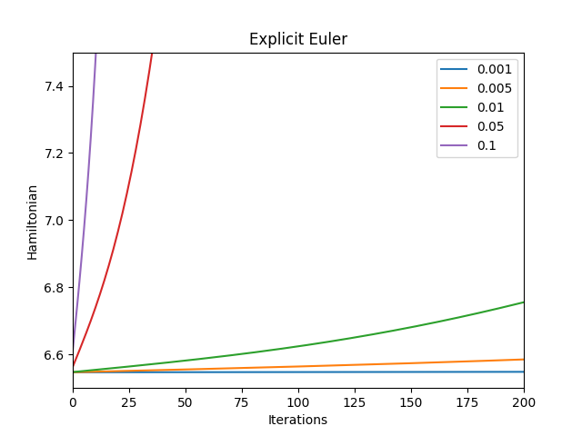
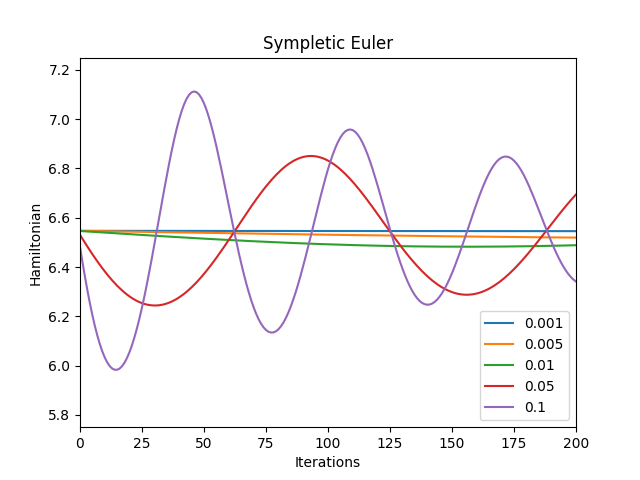
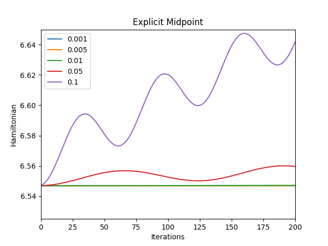
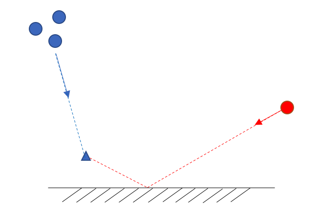

# Assignment 3 - Boids

Note:
* The window size is changed to 1000 x 1000 for better visibility. If this does not fit to your screen this can simply be adjusted in the main.cpp file. Note that in this case the gui positions need to be adjusted manually.
* All important functionalities are commented so please refer to this for further understanding
* All in all this assignment was much fun and highly addictive to play further

## 1 Basic Time Integration

For this part the explicit Euler scheme is used for numerical integration. The time step h can be adjusted by the respective slider in the command window.\
The initial velocity can be set to zero or to a random value with a uniformly distributed direction angle and a norm of 0.2.
A constant acceleration in the y-direction is given to simulate gravity.

## 2 Advanced Time Integration

The initial positions are set random and the initial velocities to (-y_i, x_i) such that the boids start to move in a circle with constant velocity around the origin which is drawn as a black circle.
A centripetal force is applied to keep the boids on a circular motion F = v^2/d_i * (-x, -y)/sqrt(x^2+y^2) with d_i the initial distance to the origin.\
Since the numerical integration scheme approximate the underlying dynamics by a lower order polynomial via Taylor expansion this assumption can be come invalid and lead to instability if the time step is too big.
Note that if the scheme is stable the velocity along this circular motion stays constant and thus the Hamiltonien H = T + V remains constant. Thus the Hamiltonian can be analyzed for different time steps in order to access the stability of the scheme.\
As for Hamiltonian systems like this one the Hamiltonian can be conserved using sympletic integrators [1](https://en.wikipedia.org/wiki/Symplectic_integrator) and [2](http://sanzserna.org/pdf/507_symplectic_encyclo.pdf).
Explicit methods can never be stable for all possible time steps (A-stable) and eventually become unstable for a big enough time step. This can be seen in the explicit Euler and Midpoint scheme.\
The explicit Euler scheme is 1st order accurate it becomes unstable already for small time steps whereas the explicit Midpoint scheme also known as RK-2 scheme is 2nd order accurate starts to diverge for bigger time steps.\
In fact only some implicit methods can be stable for any time step. For a Hamiltonian system like this stability can also be achieved using a sympletic integrator which combines an explicit integration on the position and and implicit integration on velocity.
It becomes clear that with the sympletic Euler scheme the Hamiltonian is conserved and thus the scheme remains stable for any time step. Note that for big time steps the solution might start to oscillate but does not diverge.\
In order to assess how the different schemes perform the evolution of the Hamiltonian for different time steps (0.001 to 0.1) is plotted for 20 boids for 200 integration steps. The seed for the random position is set to 1 for reproducibility. The plotting script can be found in the 'plotting' directory.

\
*Figure 1: The explicit Euler scheme already starts to diverge at very small time steps. The bigger the time step the faster it start to diverge. It is clearly not A-stable.*
\
\
*Figure 2: The sympletic Euler scheme conserves the Hamiltonian asymptotically. For big time steps the Hamiltonian starts to oscillate with a higher frequency but still does not diverge.
It is thus well suited for these Hamiltonian system.*

\
*Figure 3: The explicit Midpoint scheme starts to diverge but at bigger time steps than the explicit Euler scheme. It is therefore not A-stable but performs better than explicit Euler.*

It becomes clear the sympletic Euler scheme is best suited for this case and the explicit Midpoint rule is more accurate than the explicit Euler method but requires more computations.

## 3 Flocking
For the following boid behaviours the sympletic Euler scheme is used due to the fact that it is accurate for big time steps.\
The boids position is initialized uniformly between 0 and 1 and the velocity is initialized with uniformly distributed direction angle and a norm of 0.2 for alignment and separation otherwise to zero.\
The number of initial spawned boids, time step and mass of the boids can be adjusted by the corresponding slider.

### 3.1 Cohesion
In order to form a flock the boids are experiencing an attraction force to the average direction of its neighbors within the 'cohesion radius'. This parameter can be changed during simulation with the respective slider.
In addition to this a friction force is implemented to slow down the boids when approaching each other.

### 3.2 Alignment
In order to move into the same direction as its neighbors each boid experiences an attraction force towards the average velocity of the boids within its 'alignment radius'.
To keep the boids moving for visualization no friction is added here.

### 3.3 Separation
The boids experience an repulsive force if they are within the 'separation radius' of each other. The force added here is proportional to the distance between the boids to the power of -1/(damping+1).
So for 'damping' = 0 the repulsive force is proportional to 1/distance and for 'damping' = 1 proportional to 1/distance^0.5. Thus increasing damping softens this attraction force and prevents fast oscillations between the boids.

### 3.4 Collision Avoidance
Here 10 randomly distributed circles are spawned to simulate obstacles. In addition to the forces introduced before the boids are experience a force perpendicular to the obstacle boundary if the are within the obstacle.
This repulsive force is scaled such that the impact hard. The boids are required to track a 'tracking velocity' which makes them move towards the North-West direction and shows how they behave when colliding with an obstacle.

## 4 Collaborative and Adversarial Behaviours

### 4.1 Leader Following
The leader used here is green and has bigger size than the other boids. It can be dragged around with the mouse.
The boids experience the flocking forces so they stay close, head in the same direction, avoid overcrowding and experience some friction which prevents them from overshooting when moving quickly.
In addition to that the boids experience an attraction force towards the leader as long as they are within the 'leader observation' and outside the 'leader approach stop' radius.
The later ensures that the boids stop trying to move toward the leader when they have formed a group around the leader and do not oscillate. 

### 4.2 Collaborative and Adversarial Behaviours
The boids are initially split into two groups and initialized with random positions and velocities. Per default the experiences no force and move in straight lines.\
Via the terminal the number of boids of each group is printed as well as the number of steps until one group eliminated the other.\
In order to keep them in the view field and to observe the population they are constrained to move within the unit square and change their velocity when hitting a wall.\
A new boid is spawned at a random position and velocity of the same type of group as the two boids close to each other if the following conditions hold: The boids are from the same group, they are within the 'breeding radius', they both did not spawn a boid within the last 'breeding pause steps', 
as well as the number of newly breeded boids per time step '# max boid per iteration' is not reached. In addition the number of maximal boids is limited. All these parameters can be changed in the Gui.\
A boid is eliminated if there are three or more boids of the other group within the 'elimination radius'.

The behavior of the boids for the following strategies is very interesting and highly addictive to play with. Especially when changing the parameters of the rules different strategies might become better suited and passive behaviour can outweigh aggressive behaviour and vice versa.\
For this the following two non-aggressive and two aggressive strategies are performed which all can be changed while running the simulation:

- The first strategy tries to eliminate the other groups simply by being faster at spawning new boids and thus increasing the number of boids over time. In order to be as fast as possible from the beginning with creating new boids each boid is looking for the clostest boid of its own group and stays with it.
The small flocks continuously spawn new boids and eliminate enemies who pass by. This strategy seems to work well if the 'elimination radius' is small and thus boids only get eliminated when they are to a dense group of enemies and the 'breeding radius' is small, too.

- In the second strategy the boids towards the center and form a flock there. It is very defensive since it is difficult for the enemy group to break through a big wall of boids. If the enemy boids have no strategy they eventually move through the center and get eliminated.

- The third strategy is aggressive. First the boids form groups of at least three and then start chasing the closest enemy. The group size is specified to three such that it is able to eliminate enemies and still breed new ones. The size of this hunter group can be adjusted with the slider 'hunter group size'.
If a boids is not within a group of three of size 'hunter size group' it moves towards the closest boid of its own group to for a new hunter group.

- Finally the forth strategy improves the motion of the hunter group of the third strategy. Since it could be observed that if the hunter group has the same velocity as the enemy boid it not possible to fully catch up with it. Thus as for real birds which are fighting in the air they try to access where this enemy is moving next.
As the boids are constrained within the unit square the bounce off when hitting it. The hunter size group predicts the collision point of the enemy boid with the wall it is moving towards and the angle with which it is bouncing off assuming a rigid collision. It then moves towards the point of the predicted bounce off trajectory of the enemy boid with some distance to the wall and waits there to catch the enemy boid passing by.\
With this the hunter size group is almost always guaranteed to catch up with the closest enemy and eliminate it. It works perfectly when the enemy boids are assumed to have no strategy and just move in straight lines.
  
\
*Figure 4: The hunter group predicts where the enemy boid is bouncing off and moves towards the bounce off trajectory with some distance to the wall.*

Comparing the different strategies it becomes clear that it is suitable for the boids to form groups as in the real world. Depending on the parameters of the rules it encourages a more aggressive or non-aggressive behaviour. Different duels are performed and the number of moves until a group wins is printed via the terminal.

**Videos**

*Integrations*

[Freefall explicit euler](https://youtu.be/TdaEwReh2w8) \
[Circular motion explicit euler](https://youtu.be/4202L_d4uQ0) \
[Circular motion sympletic euler](https://youtu.be/oZ0-FYplhFU) \
[Circular motion explicit midpoint](https://youtu.be/v-LuazRy1S0)

*Behaviours*

[Cohesion](https://youtu.be/nuChu681rR4) \
[Alignment](https://youtu.be/_KXHmmVUJRo) \
[Separation](https://youtu.be/p-WlXfxKp2g) \
[Collision avoidance](https://youtu.be/M4KcP-q62gA) \
[Leader following](https://youtu.be/Rq4XdId5Oa0)

*Collaborative and adversarial battles*

[Both no strateggy](https://youtu.be/D71QxN4thqk) \
[One group chases closest enemy, other has no strategy](https://youtu.be/kb8pnqIRmj8) \
[One group goes to closest, other has no strategy](https://youtu.be/1Q7g0_Atf4c) \
[One group moves to center, other has no strategy](https://youtu.be/lajx7Gs6t9E) \
[One group predicts bounce off point, other has no strategy](https://youtu.be/zt8-Xg1q_7g) \
[One group to center, other chases closest enemy](https://youtu.be/_M0Z4JCA7Co) \
[One group predicts bounce off point, other chases closest enemy](https://youtu.be/r0okQmyQQLg) \
[One group goes to closest, other chases closest](https://youtu.be/xTz_xXzX5pw)