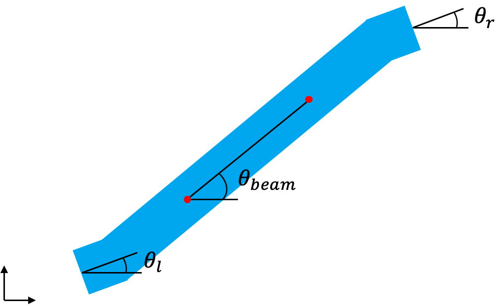

First Name: Robin

Last Name: Schmid

Solution to Question 4:
````math
Option 1:
F = [f_11, f_12;
    f_21, f_22]
F^T * F = [f_11^2 + f_21^2, f_11*f_12 + f_21*f_22;
           f_11*f_12 + f_21*f_22, f_12^2 + f_22^2]
F^T * F - I = [f_11^2 + f_21^2 - 1, f_11*f_12 + f_21*f_22;
              f_11*f_12 + f_21*f_22, f_12^2 + f_22^2 - 1]
tr(F^T * F - I) = f_11^2 + f_21^2 - 1 + f_12^2 + f_22^2 - 1 = f_11^2 + f_12^2 + f_21^2 + f_22^2 - 2
(||F||_F)^2 - 2 = f_11^2 + f_12^2 + f_21^2 + f_22^2 - 2 qed.

Option 2:
tr(F^T*F - I) = tr(F^T*F) - tr(I) = tr(F^T*F) - 2 = (||F||_F)^2 - 2 qed.
````

Solution to Question 10:
The objective does only penalize the difference of x_prime to x for some feature points.
Since the optimization objective is
````math
O = E_tot = E_FEM + E_pin = 0.5*||x-x'||^2 + 0.5*k*||p-p'||^2
````
only the feature points and pin positions are optimized.\
The pin orientations are not accounted for and thus multiple solutions exist with different pin orientations.\
Not optimizing over all points or neglecting the pin orientations results in solution which is not minimal energy.\
The tracking of a desired pin orientation can simply be achieved by implementing a penalty which accounts for this orientation.

Solution to Question 11:
The idea is simply to add a cost term which penalizes the difference in the pin orientation to the orientation of the line connecting the target points.\
This ensures that the beam ends are oriented such that the pin orientations are constantly aligned with the beam.\
The resulting cost function is then
```math
O = E_tot + E_orientation_penalty
  = 0.5*||x-x'||^2 + 0.5*k*||p-p'||^2 + lambda*(||theta_beam-theta_l||^2 + ||theta_beam-theta_r||^2)
```
where lambda is the regularization parameter and can be tune.\
Adding this penalty reduces the energy of the solution found and leads to a result similar to as in figure 2 of the write-up.\
A bigger lambda enforces the pin orientations to be aligned with the beam more strictly and the value 0.5 is chosen here since it leads to a satisfying result.\
The following figure illustrates this principle.

\
*Figure 1: Pin and beam orientation.*
---

Assignment writeup: http://crl.ethz.ch/teaching/computational-motion-21/slides/tutorial-a4.pdf

---

Could use ./build.sh on Linux/MacOS