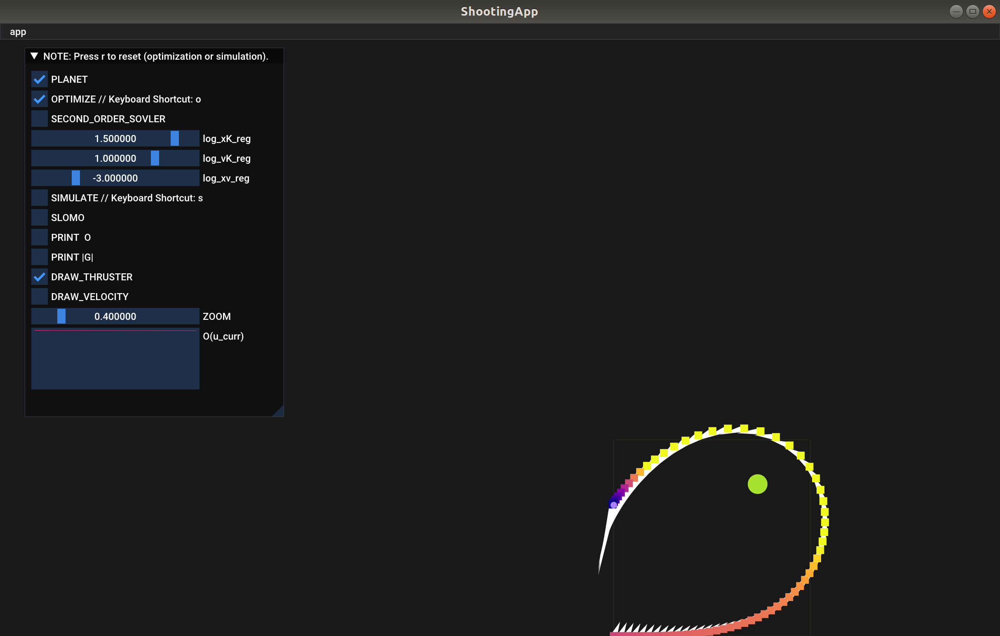
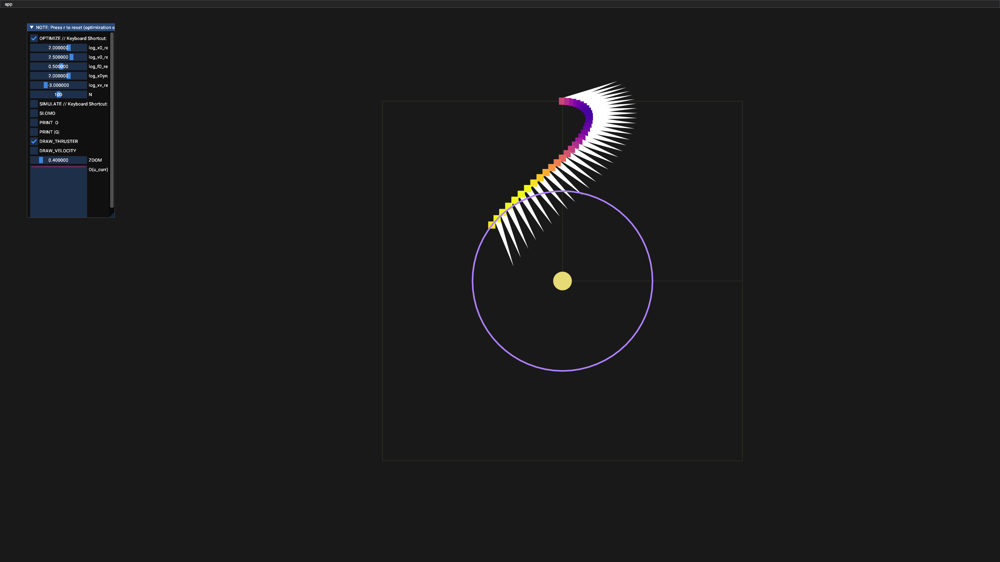
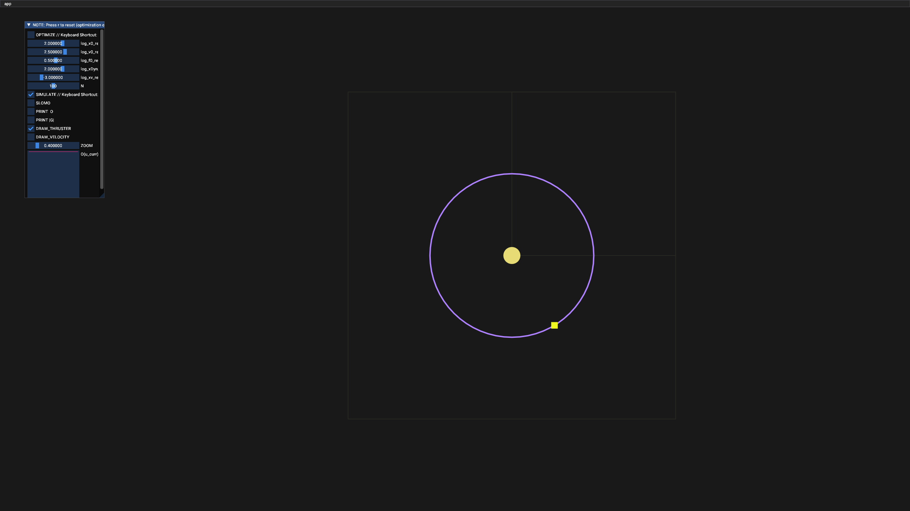

# Assignment 6 - Trajectory Optimization

**Hand-in:** May 28, 2021, 18:00 CEST 

First Name: Robin

Last Name: Schmid

Video for challenge question: [Challenge](https://youtu.be/rAHrlqHJgQU)

Solution to Question 2:
````math
a_{k} = F_{k}/m = 1/h*(v_{k+1} - v_{k}) = 1/h*(1/h*(x_{k+2} - x_{k+1}) - 1/h*(x_{k+1} - x_{k})) = (x_{k+2} - 2*x_{k+1} + x_{k})/h^2
````

Solution to Question 5:
In a perfect setting it should take Newton's method 1 step to converge. Since Newton's method approximates the function as a quadratic function it would take exactly 1 time step if the function is quadratic.
In principle this is satisfied here since the objective is quadratic in u as x and v are linear in u but if the Hessian has eigenvalues close to zero inverting it can cause numerical errors which takes Newton's method a bit more than one step (4-5) to converge in practice.
Note that gradient descent takes approximately 30-50 steps to converge here and does oscillate since the eigenvalues of the Hessian are of different sizes.

Solution to Question 7:

*Figure 1: Direct shooting with planet*

Solution to Question 9:
It does not work with gradient descent. Since the objective depends on x, v and u with different scales, the eigenvalues of the Hessian of the objective differ in multiple magnitudes.
The problem is thus ill-conditioned. Using gradient descent the gradient is huge in one direction and very small in another leading to jumps when descending which can be seen in oscillations and a very slow convergence when optimizing.
A solution to this is using a second order method like Newton's method. It rescales the objective using the inverse of the Hessian. Visually this corrects the contour lines of this quadratic objective from very stretched ellipses to circles
so using line search leads to the optima in just 1 iteration.
The toy example resembles the problem of this objective. Its Hessian is very ill-conditioned since the eigenvalues differ a lot in their sizes. Using gradient descent will lead to a very oscillatory and slow converging solution.

Explanation of your approach to Question 10 (required for full credit):\
In order to keep the spaceship on the orbit the following conditions need to hold:
* x_{K}, the position at timestep K, is on the orbit\
  ````O_position_K = x0_reg * ||x_{K} - x_sun| - r'|^2 ````
* v_{K}, the velocity at timestep K, is perpendicular to the vector from the spaceship to the sun\
  ````O_velocity_K = v0_reg * (v_{K}^T * (x_{K} - x_sun))^2````
* f_{K}, the thruster force at timestep K, compensates the centripetal force from orbit\
  ````O_force_K = f0_reg * (F - m * |v_{K}|^2 / r')^2````

In addition to this to keep the spaceship on the orbit for future timesteps where no input it is additionally enforced that:
* x_bar_{K} up to x_bar_{K+N} is on the orbit, where x_bar is propagated using sympletic Euler\
  ````O_position_KtoK+N = xDyn_reg * sum{k=K}_{K+N}(||x_{k} - x_sun| - r'|^2)````
  
Finally a regularizer is added to help to converge:\
````O_regularization = xv_reg * |u_stack|^2````


This leads to the following optimization objective:
````math
O = O_position_K + O_velocity_K + O_force_K + O_position_KtoK+N + O_regularization
````
where x0_reg, v0_reg, f0_reg, xDyn_reg and xv_reg and N are tuning parameters and can be changed via the respective sliders.
Experiments showed this implementation remained stable after letting it run several minutes as shown in this video [Challenge](https://youtu.be/rAHrlqHJgQU).

\
*Figure 2: Optimized path for orbit tracking*


\
*Figure 3: Spaceship position after several orbit rotations*

---

Assignment writeup: http://crl.ethz.ch/teaching/computational-motion-21/slides/Tutorial-Write-Up-6.pdf

---

- NOTE: Don't forget to switch to Release mode or Release With Debug Info otherwise it's gonna be just unimaginably slow.
- NOTE: Tested builds: GCC 9.3 (Linux), Visual Studio 2019 (Windows), Clang 12.0.0 (Mac OS)
